# Ferris Aegis — Additional Visual Diagrams

This document contains high-quality Mermaid diagrams for key architectural flows, state machines, and security models not covered in the main specification.

---

## 1. Trust Level Hierarchy & Capability Progression

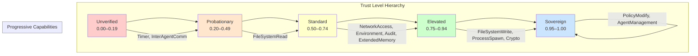

---

## 2. Agent Lifecycle State Machine

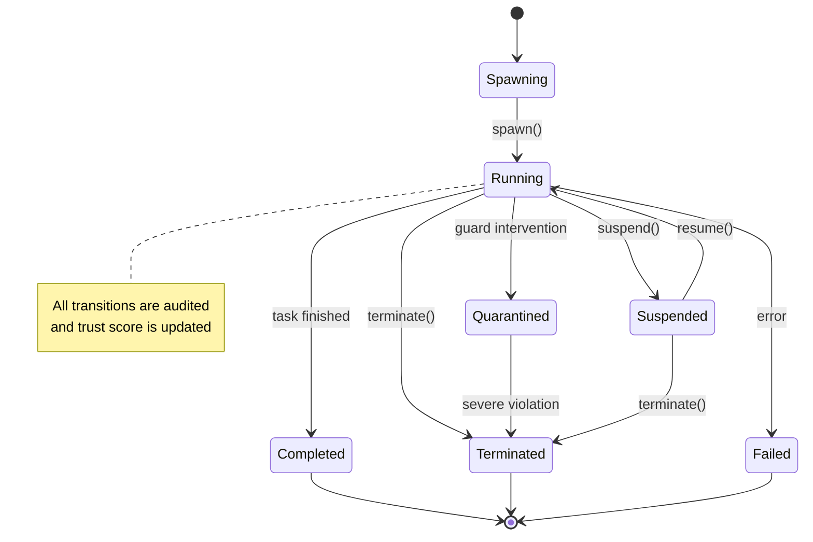

---

## 3. Policy Evaluation Flow

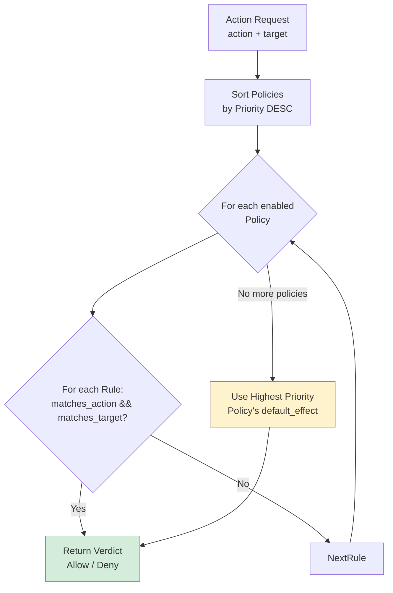

---

## 4. Credential Protection Flow (INV-001)

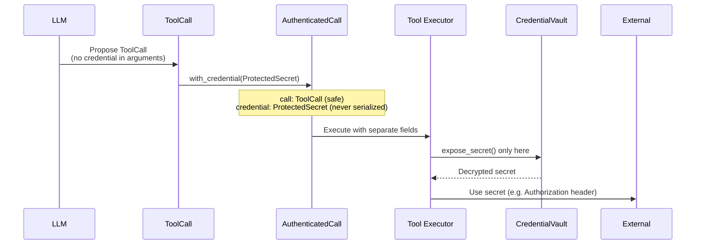

---

## 5. Guard Escalation Ladder

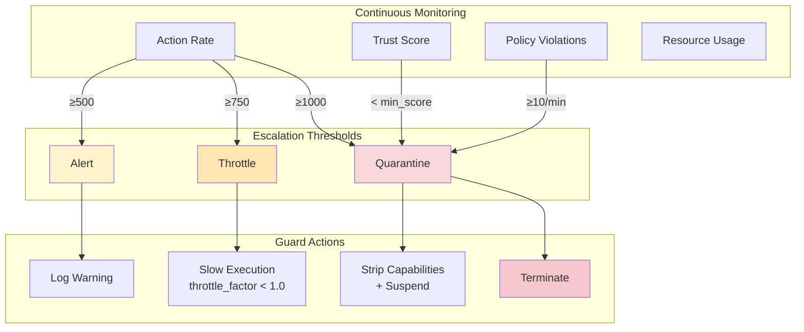

---

## 6. Full System Data Flow

```mermaid
flowchart LR
    subgraph Agent["Agent Request"]
        Req[Action]
    end

    subgraph Core["Kernel Layer"]
        Policy[PolicyEngine]
        Sandbox[Sandbox]
        Guard[Guard]
        Audit[AuditLedger]
        Trust[TrustKernel]
    end

    subgraph Security["Security Layer"]
        Allow[Allowlist]
        Inject[InjectionScanner]
        SSRF[SsrfGuard]
        Vault[ProtectedSecret Vault]
    end

    subgraph Execution["Execution Layer"]
        Skills[SkillExecutor]
        WASM[WasmSandbox]
        MCP[MCP Server]
    end

    subgraph Observability["Observability"]
        OTel[OTel Spans]
        Metrics[Prometheus]
        Log[JSON stderr]
    end

    Req --> Policy
    Policy -->|Allowed| Sandbox
    Sandbox --> Guard
    Guard -->|No intervention| Security
    Security --> Execution
    Execution --> Audit
    Audit --> Trust
    Trust -->|reinforce/penalize| Observability

    Guard -->|Quarantine/Terminate| Audit
    Security -->|Denied| Audit

    style Core fill:#e3f2fd
    style Security fill:#fff3e0
    style Execution fill:#f3e5f5
    style Observability fill:#e8f5e9
```

---

## 7. Resilience Composition Pipeline

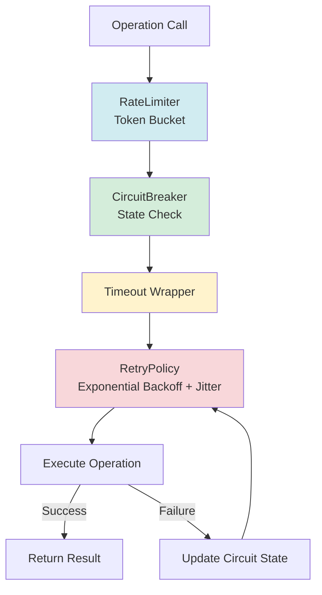

---

## 8. Skill Execution with Trust Gating

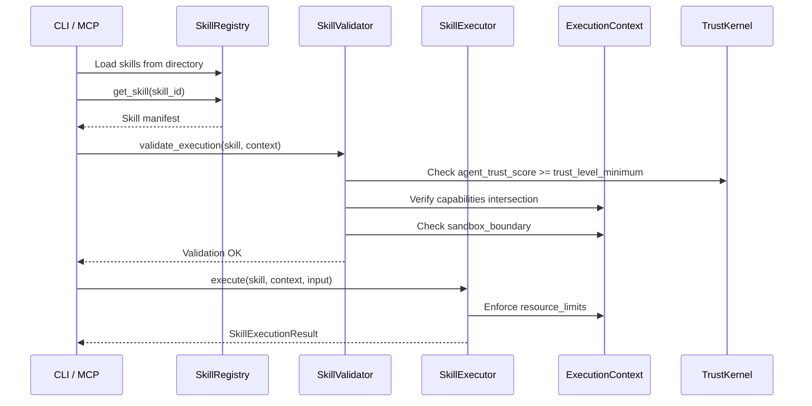

---

These diagrams complement the main `SPECIFICATION.md` and can be rendered in any Markdown viewer that supports Mermaid (GitHub, GitLab, VS Code, etc.).

**Next Steps Recommendation**: Render these diagrams using a Mermaid live editor or integrate them into documentation using tools like `mmdc` (Mermaid CLI) for PNG/SVG export.

---

## 9. WASM Sandbox Execution Flow

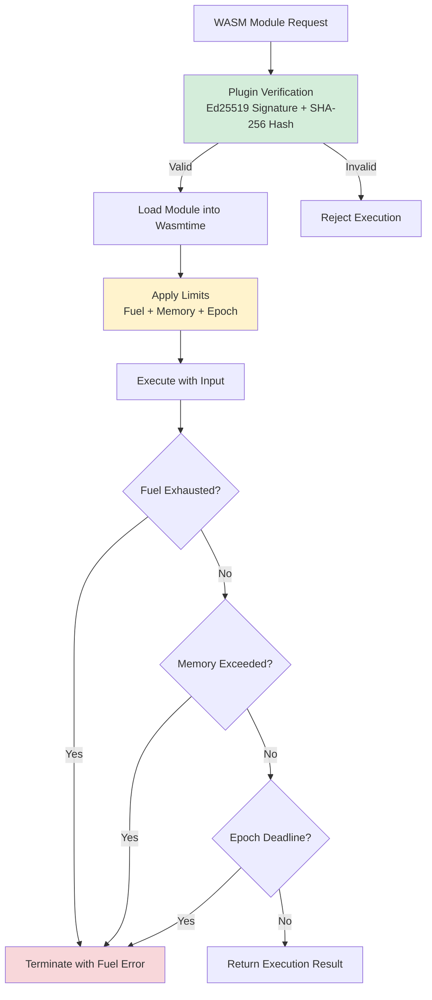

**Safety Layers**:
- **Fuel Metering** (default 10M instructions)
- **Memory Cap** (default 64 MiB)
- **Epoch Interruption** (hard deadline)
- **Plugin Attestation** (Ed25519 + module hash)

---

## 10. A2A Routing with Trust Gating

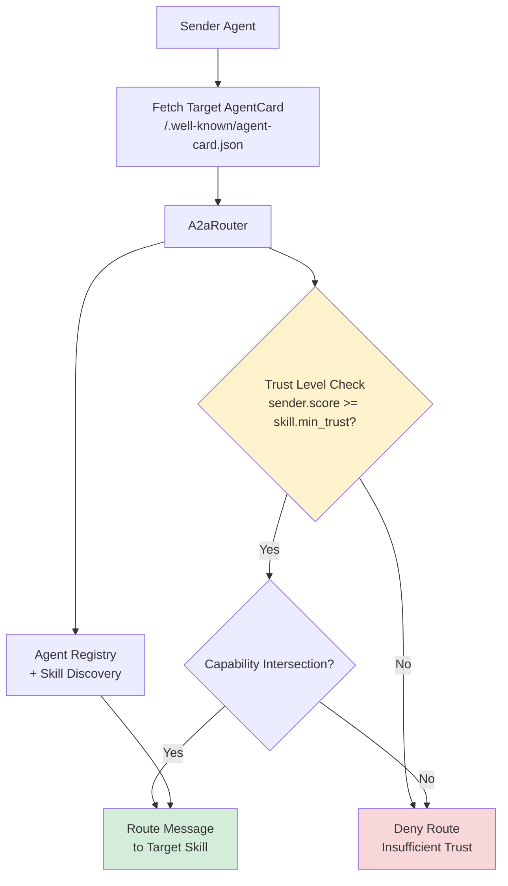

**Trust-Gated Routing Logic**:
1. Sender presents `AgentCard`
2. Router queries `TrustKernel` for sender’s current score
3. Target skill declares `trust_level_minimum`
4. Message is routed only if `sender_score >= minimum`
5. Capability intersection is also validated

---

## 11. Plugin Signing & Verification Flow

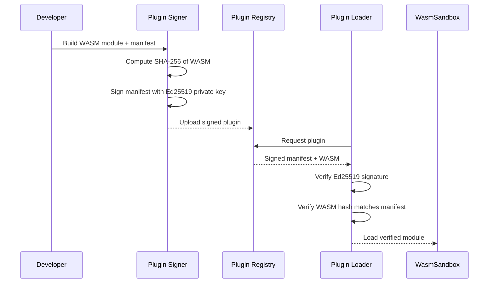

**Verification Steps**:
1. Ed25519 signature validation on manifest
2. SHA-256 hash of WASM matches declared value
3. Only then is the module loaded into the sandbox

---

## 12. Observability Pipeline

```mermaid
flowchart LR
    subgraph Sources["Telemetry Sources"]
        Kernel[Kernel Components]
        MCP[MCP Handlers]
        Skills[Skill Executor]
        Guard[Guard Alerts]
    end

    subgraph Pipeline["Observability Pipeline"]
        OTel[OpenTelemetry<br/>Batch Export]
        Prom[Prometheus<br/>Registry]
        JSON[JSON Structured Logging<br/>stderr only]
    end

    subgraph Consumers["Consumers"]
        Jaeger[Jaeger / Tempo]
        Grafana[Grafana]
        Loki[Loki / Datadog]
    end

    Kernel --> OTel
    MCP --> OTel
    Skills --> OTel
    Guard --> OTel

    Kernel --> Prom
    MCP --> Prom
    Skills --> Prom

    Kernel --> JSON
    MCP --> JSON
    Skills --> JSON
    Guard --> JSON

    OTel --> Jaeger
    Prom --> Grafana
    JSON --> Loki

    style JSON fill:#f8d7da
    note right of JSON
        MCP owns stdout.
        All logs go to stderr.
    end note
```

---

## 13. MCP + Skills Integration

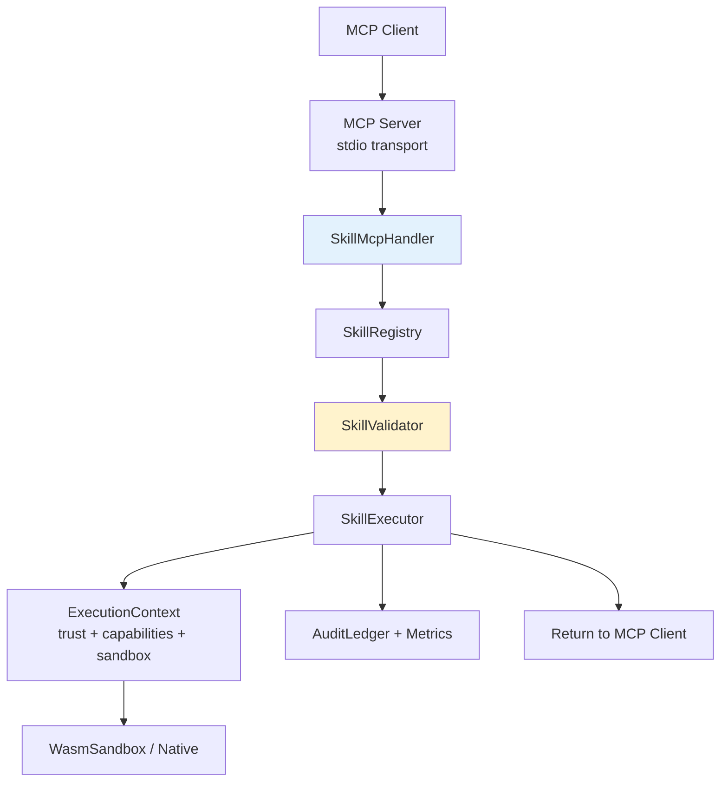

---

These additional diagrams complete the visual documentation suite for Ferris Aegis.

---

## 14. Session Lifecycle with Budgets

```mermaid
stateDiagram-v2
    [*] --> Created
    Created --> Active : start_session()
    Active --> Active : round_completed()
    Active --> BudgetCheck{Budget Check}

    BudgetCheck -->|Tokens / Cost / Rounds / Time OK| Active
    BudgetCheck -->|Any Budget Exhausted| Terminal

    Active --> Suspended : manual suspend
    Suspended --> Active : resume()

    Terminal --> Completed : normal end
    Terminal --> Terminated : forced termination

    Completed --> [*]
    Terminated --> [*]

    note right of Active
        Budgets tracked:
        - tokens_used
        - cost_usd
        - rounds
        - wall_clock_time
    end note
```

---

## 15. Semantic Memory Pipeline

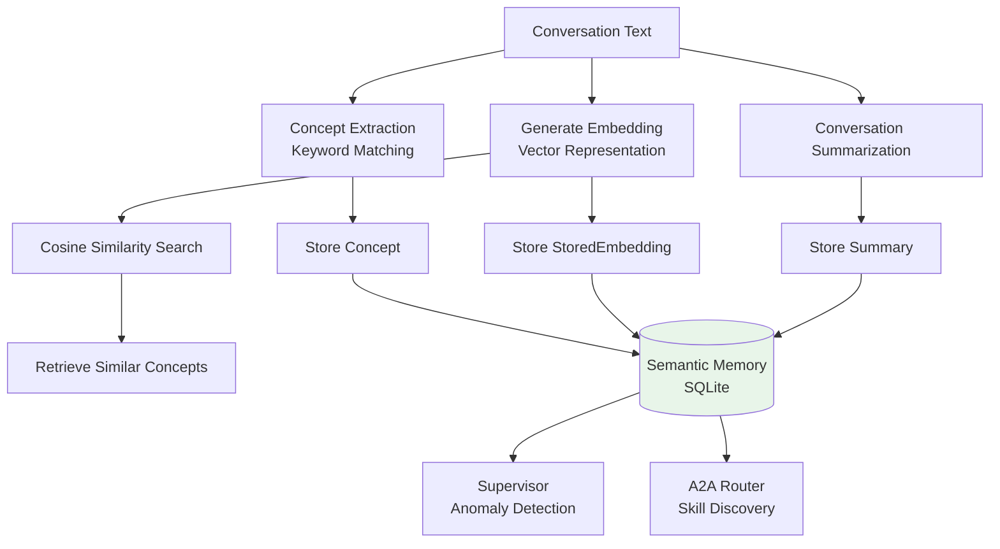

**Components**:
- `Concept` extraction
- `StoredEmbedding` with cosine similarity
- `Summary` for conversation compression
- Used by Supervisor and A2A routing

---

## 16. Resilience State Machines

```mermaid
stateDiagram-v2
    direction LR

    subgraph CircuitBreaker["Circuit Breaker States"]
        Closed -->|N failures| Open
        Open -->|Timeout| HalfOpen
        HalfOpen -->|M successes| Closed
        HalfOpen -->|Failure| Open
    end

    subgraph Retry["Retry Policy"]
        Attempt -->|Failure + attempts left| Backoff[Exponential Backoff<br/>+ 25% Jitter]
        Backoff --> Attempt
        Attempt -->|Success| Success
        Attempt -->|Max attempts| Fail
    end

    subgraph RateLimiter["Rate Limiter"]
        Request --> TokenCheck{Token Available?}
        TokenCheck -->|Yes| Execute
        TokenCheck -->|No| Wait[Wait for refill]
        Wait --> TokenCheck
        Execute --> Refill[Token Refill<br/>(token bucket)]
    end
```

**Combined Resilience Execution**:
All three primitives are composed in `execute_resilient()`.

---

## 17. Consolidated Architecture Overview (Multi-View)

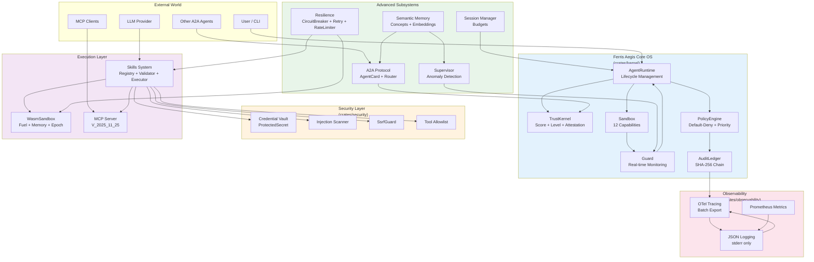

**Legend**:
- **Blue**: Core OS primitives
- **Orange**: Security & isolation
- **Purple**: Execution & skills
- **Green**: Advanced memory & orchestration
- **Pink**: Observability (always active, stderr-only)

---

## 18. Complete Component Dependency Graph

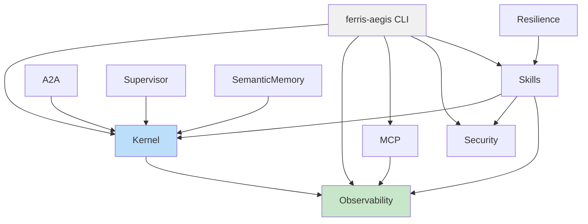

---

**Document Complete** — 18 diagrams covering all major subsystems of Ferris Aegis.

---

## 19. A2A Message Routing Sequence

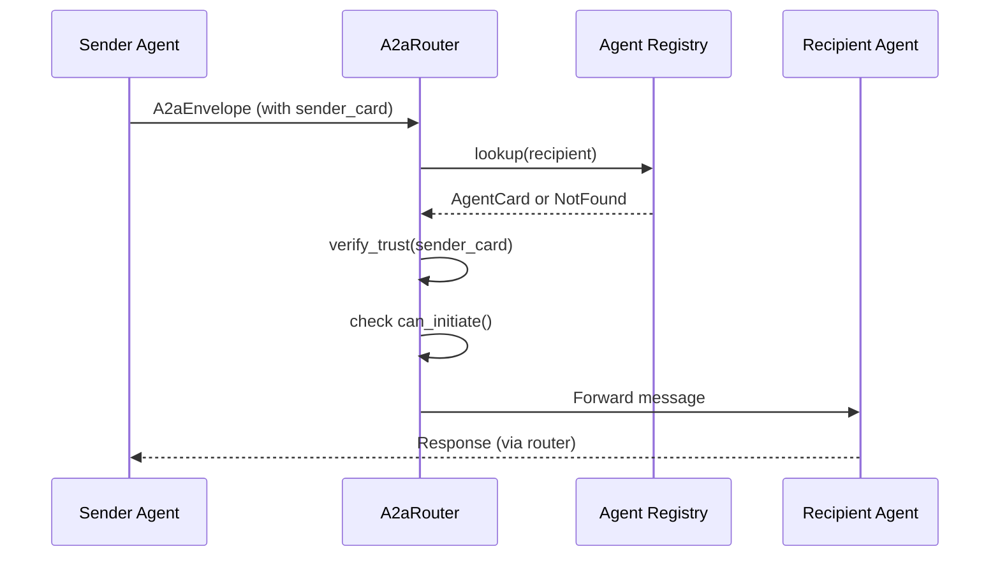

---

## 20. Resilience Execution Layers

```mermaid
flowchart TD
    Request[Incoming Request] --> CB[Circuit Breaker<br/>allow_request()]
    CB -->|Allowed| Retry[RetryPolicy<br/>execute()]
    Retry --> Timeout[with_timeout()]
    Timeout --> Operation[Actual Operation]
    Operation -->|Success| RecordSuccess[record_success()]
    Operation -->|Failure| RecordFailure[record_failure()]

    RecordSuccess --> Return[Return Result]
    RecordFailure --> Return

    style CB fill:#bbdefb
    style Retry fill:#c8e6c9
    style Timeout fill:#fff9c4
```

---

## 21. Circuit Breaker State Transitions

```mermaid
stateDiagram-v2
    Closed -->|failure_count >= threshold| Open
    Open -->|recovery_timeout elapsed| HalfOpen
    HalfOpen -->|success_count >= threshold| Closed
    HalfOpen -->|failure| Open
    Closed -->|manual force_open| Open
    Open -->|manual force_closed| Closed
```

---

These additional diagrams provide deeper insight into A2A routing mechanics and resilience behavior.