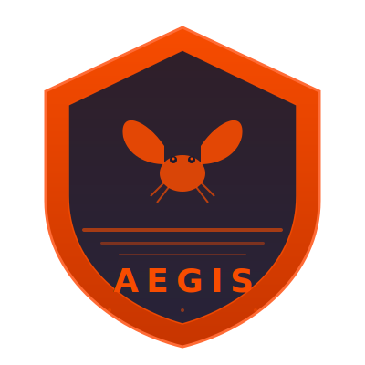

<p align="center">
  
</p>

<h1 align="center">Ferris Aegis</h1>

<p align="center">
  <strong>The Rust Guardian for Autonomous Intelligence</strong>
</p>

<p align="center">
  An operating system for trustworthy agents — where safety is not a feature, it's the foundation.
</p>

<p align="center">
  
  
  
</p>

---

## 🛡️ What is Ferris Aegis?

Ferris Aegis is a Rust-powered operating system framework for building, running, and monitoring **autonomous AI agents** with strong guarantees around:

- **Safety** — Agents can only do what they're explicitly permitted to do
- **Auditability** — Every action is recorded in a tamper-evident cryptographic ledger
- **Trust** — Agents earn trust through good behavior and lose it through violations
- **Isolation** — Capability-based sandboxes enforce the principle of least privilege
- **Oversight** — Real-time monitoring detects and intervenes when agents go rogue
- **Observability** — OTel tracing, Prometheus metrics, and structured JSON logging from day one
- **Interoperability** — MCP stdio server with full instrumentation for tool-calling integration

## 🏗️ Architecture

Ferris Aegis is built as a **Cargo workspace** with four crates:

```
┌─────────────────────────────────────────────────────────┐
│                     FERRIS AEGIS                        │
│                   Workspace Root                        │
├──────────┬──────────┬───────────┬───────────────────────┤
│          │          │           │                       │
│  crates/ │ crates/  │  crates/  │  src/main.rs         │
│  kernel  │ observa- │   mcp     │  (CLI binary)        │
│          │ bility   │           │                       │
│  ┌─────┐│ ┌──────┐ │ ┌───────┐ │                       │
│  │Trust││ │OTel  │ │ │MCP    │ │                       │
│  │Kern ││ │Tracing│ │ │Server │ │                       │
│  │     ││ │      │ │ │       │ │                       │
│  ├─────┤│ ├──────┤ │ ├───────┤ │                       │
│  │Agent││ │Prom- │ │ │file_  │ │                       │
│  │Run- ││ │etheus│ │ │read   │ │                       │
│  │time ││ │      │ │ │tool   │ │                       │
│  ├─────┤│ ├──────┤ │ ├───────┤ │                       │
│  │Policy│ │JSON  │ │ │Instru-│ │                       │
│  │Eng  ││ │stderr│ │ │mented │ │                       │
│  ├─────┤│ │      │ │ │       │ │                       │
│  │Audit││ └──────┘ │ └───────┘ │                       │
│  ├─────┤│          │           │                       │
│  │Sand ││          │           │                       │
│  │box  ││          │           │                       │
│  ├─────┤│          │           │                       │
│  │Guard││          │           │                       │
│  └─────┘│          │           │                       │
│          │          │           │                       │
└──────────┴──────────┴───────────┴───────────────────────┘
```

### Crate Dependency Graph

```
kernel ← observability (kernel does NOT depend on observability yet)
mcp    ← observability
CLI    ← kernel, observability, mcp
```

**Key invariant:** `observability` has zero dependency on `kernel`. It is pure infrastructure that builds and tests before any agent code exists.

### Core Pillars (Phase 1 — `crates/kernel`)

| Pillar | Module | Description |
|--------|--------|-------------|
| 🏛️ **Trust Kernel** | `kernel` | Trust scores (0.0–1.0), 5 levels (Unverified→Sovereign), attestation, decay |
| 🤖 **Agent Runtime** | `agent` | Lifecycle: spawn → suspend → resume → quarantine → terminate |
| 📜 **Policy Engine** | `policy` | Declarative TOML policies, priority ordering, default-deny |
| 📋 **Audit Ledger** | `audit` | SHA-256 chained append-only ledger with tamper detection |
| 🏖️ **Sandbox** | `sandbox` | 12 capability types, trust-level boundaries, resource limits |
| 🛡️ **Guard** | `guard` | Real-time monitoring: alert → throttle → quarantine → terminate |

### Observability (Phase 2 Week 3 — `crates/observability`)

- **OTel Tracing** — Every agent round, tool call, and provider interaction produces a span tree visible in Jaeger
- **Prometheus Metrics** — Three core metrics (`requests_total`, `tokens_used_total`, `tool_calls_total`) exposed via `Registry`
- **JSON Structured Logging** — All output to stderr only, machine-parseable, zero stdout leakage
- **stderr enforcement** — The subscriber is built with `with_writer(std::io::stderr)`. One misconfigured `println!` cannot corrupt the MCP wire

### MCP Server (Phase 2 Week 4 — `crates/mcp`)

- **Protocol:** MCP over stdio, targeting `V_2025_11_25` (stable spec, explicitly pinned — never `.LATEST`)
- **Tool:** `file_read` — reads a file from the local filesystem with security constraints
- **Instrumented from birth** — Every tool handler creates an OTel span and increments Prometheus counters
- **Security:** Absolute paths only, directory traversal rejected, symlink resolution via canonicalization

**Explicitly excluded from Week 4 core:**
- HTTP/SSE transport, legacy version fallback, OAuth 2.1
- Resource/prompt surfaces, any client-side code
- MCP conformance suite (deferred to Week 4b gate)

## 🚀 Quick Start

### Prerequisites
- Rust 1.82 or later

### Build

```bash
git clone https://github.com/Abdus2023/Ferris-Aegis-The-operating-system-for-trustworthy-agents-.git
cd Ferris-Aegis-The-operating-system-for-trustworthy-agents-
cargo build --release
```

### Initialize

```bash
# Create default configuration and policies
./target/release/aegis init

# View the generated config
cat aegis.toml

# View the default safety policy
cat policies/default-safety.toml
```

### Start the Daemon

```bash
# Run in foreground mode (with full observability stack)
./target/release/aegis start --foreground
```

### Start the MCP Server

```bash
# Start MCP stdio server (for use with MCP clients)
./target/release/aegis mcp
```

### Manage Agents

```bash
./target/release/aegis agent spawn my-agent
./target/release/aegis agent list
./target/release/aegis agent suspend <agent-id>
./target/release/aegis agent resume <agent-id>
./target/release/aegis agent terminate <agent-id>
```

### Manage Policies

```bash
./target/release/aegis policy list
./target/release/aegis policy default
./target/release/aegis policy load policies/custom.toml
```

## 📦 Library Usage

### Using the Kernel

```rust
use ferris_aegis_kernel::{
    kernel::TrustKernel,
    agent::AgentRuntime,
    policy::PolicyEngine,
};

#[tokio::main]
async fn main() -> anyhow::Result<()> {
    let kernel = TrustKernel::new();
    let policy = PolicyEngine::with_defaults();
    let mut runtime = AgentRuntime::new(kernel, policy);

    let agent_id = runtime.spawn("my-agent", "1.0.0").await?;
    println!("Agent spawned: {}", agent_id);
    Ok(())
}
```

### Using the MCP Server

```rust
use ferris_aegis_observability;
use ferris_aegis_mcp;

#[tokio::main]
async fn main() -> anyhow::Result<()> {
    let handle = ferris_aegis_observability::init().await?;
    let metrics = handle.metrics.clone();
    ferris_aegis_mcp::serve(metrics).await?;
    handle.shutdown();
    Ok(())
}
```

## 📜 Policy Format

Policies are defined in TOML:

```toml
[policy]
name = "my-policy"
version = "1.0.0"
priority = 100
enabled = true
default_effect = "deny"

[[rules]]
action = "file:read"
effect = "allow"
targets = ["/workspace/*"]
description = "Allow reads from workspace"

[[rules]]
action = "network:connect"
effect = "allow"
targets = ["api.openai.com:443"]
description = "Allow connections to OpenAI API"
```

## 🔐 Trust Levels

| Level | Score Range | Capabilities | Description |
|-------|-------------|-------------|-------------|
| 🔴 Unverified | 0.00–0.19 | Timer, Inter-agent comm | No trust established |
| 🟡 Probationary | 0.20–0.49 | + Filesystem read | Under observation |
| 🟢 Standard | 0.50–0.74 | + Network, Environment, Audit | Production-ready |
| 🔵 Elevated | 0.75–0.94 | + Filesystem write, Process spawn, Crypto | Proven track record |
| 🟣 Sovereign | 0.95–1.00 | All capabilities | System-critical agents |

## 🛡️ Guard Actions

| Action | Trigger | Effect |
|--------|---------|--------|
| Alert | Action rate exceeded | Warning logged |
| Throttle | Action rate significantly exceeded | Agent slowed down |
| Quarantine | Trust score critical / violation spike | Capabilities stripped, agent suspended |
| Terminate | Severe threat | Agent immediately killed |

## 📊 Observability

### Core Metrics

| Metric | Labels | Description |
|--------|--------|-------------|
| `ferris_aegis_requests_total` | — | Total agent requests handled |
| `ferris_aegis_tokens_used_total` | — | Total tokens consumed |
| `ferris_aegis_tool_calls_total` | `tool`, `outcome` | Tool calls by name and outcome |

### Environment Variables

| Variable | Default | Description |
|----------|---------|-------------|
| `OTEL_EXPORTER_OTLP_ENDPOINT` | `http://localhost:4317` | OTLP collector endpoint |
| `RUST_LOG` | `info,ferris_aegis=debug` | Tracing filter |

## 🧪 Testing

```bash
# Run all tests across the workspace
cargo test --workspace

# Run with output
cargo test --workspace -- --nocapture

# Run specific crate tests
cargo test -p ferris-aegis-kernel
cargo test -p ferris-aegis-observability
cargo test -p ferris-aegis-mcp
```

## 📂 Project Structure

```
├── Cargo.toml                    # Workspace root + CLI binary
├── crates/
│   ├── kernel/                   # Core agent OS (Phase 1)
│   │   └── src/
│   │       ├── lib.rs            #   Kernel library root
│   │       ├── kernel.rs         #   Trust Kernel
│   │       ├── agent.rs          #   Agent Runtime
│   │       ├── policy.rs         #   Policy Engine
│   │       ├── audit.rs          #   Audit Ledger
│   │       ├── sandbox.rs        #   Sandbox Manager
│   │       ├── guard.rs          #   Guard
│   │       └── config.rs         #   Configuration
│   ├── observability/            # OTel + Prometheus (Phase 2 Week 3)
│   │   └── src/
│   │       ├── lib.rs            #   init(), ObservabilityHandle
│   │       └── metrics.rs        #   CoreMetrics
│   └── mcp/                      # MCP stdio server (Phase 2 Week 4)
│       └── src/
│           ├── lib.rs            #   serve() entry point
│           ├── server.rs         #   Server lifecycle
│           └── tools.rs          #   file_read tool + AegisMcpServer
├── examples/
│   ├── sentinel.rs               # Agent lifecycle example
│   └── mcp-stdio.rs              # MCP server example
├── policies/
│   ├── default-safety.toml
│   └── sovereign.toml
├── tests/
│   └── integration.rs            # End-to-end integration tests
└── assets/
    ├── aegis-logo.svg
    └── aegis-banner.png
```

## 🗺️ Roadmap

### Phase 1 ✅ — Core Kernel
Trust Kernel, Agent Runtime, Policy Engine, Audit Ledger, Sandbox, Guard

### Phase 2 ✅ — Observability + MCP
- Week 3: OTel tracing, Prometheus metrics, JSON stderr logging
- Week 4: Instrumented MCP stdio server (`file_read`, `V_2025_11_25`)

### Phase 2 Week 4b (Optional, Gated)
Legacy version fallback, MCP conformance suite, HTTP/SSE transport, OAuth 2.1

### Phase 3 — Security + Episodic Memory
WASM sandboxing, credential vault with structural secret protection, SQLite episodic memory, injection scanner, SSRF guard

### Phase 4 — A2A + AgentCard (Gated on external consumer question)
Agent-to-agent protocol, discoverable AgentCard, standalone-vs-integrated architecture decision

## 🤝 Contributing

We welcome contributions! Ferris Aegis is built on the principle that trustworthy systems require trustworthy foundations.

1. Fork the repository
2. Create a feature branch
3. Write tests for your changes
4. Ensure all tests pass (`cargo test --workspace`)
5. Submit a pull request

## 📄 License

Licensed under either of:
- MIT License
- Apache License, Version 2.0

at your option.

---

<p align="center">
  <em>🦀 Built with Rust. Guarded with Aegis. Trusted by design.</em>
</p>
