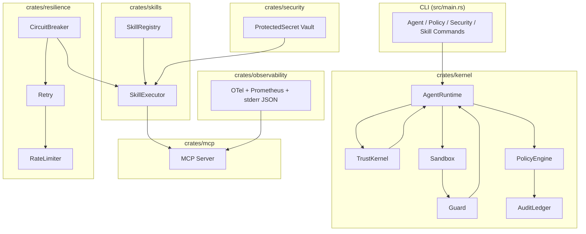

# Ferris Aegis — Technical and Formal Specification

**Version**: 0.3.0  
**Date**: 2026-07-19  
**Status**: All 5 Phases Complete  
**Repository**: `Abdus2023/Ferris-Aegis-The-operating-system-for-trustworthy-agents-`  
**Branch**: `arena/019f7b1e-ferris-aegis-the-operating-sys`

---

## 1. Executive Summary

Ferris Aegis is a **Rust-based operating system for trustworthy autonomous AI agents**. Safety, auditability, isolation, and observability are architectural foundations rather than optional features.

It implements a complete agent runtime using:
- Capability-based isolation (principle of least privilege)
- Trust scoring with dynamic capability boundaries
- Declarative policy engine (default-deny)
- Tamper-evident cryptographic audit ledger
- Real-time guard with escalation ladder
- WASM sandboxing with fuel/memory limits
- Multi-layer security (injection detection, SSRF, credential vault)
- Episodic + semantic memory
- Session management with budgets
- Anomaly-detecting supervisor
- A2A protocol with trust-gated routing
- Resilience primitives
- Full observability (OTel + Prometheus + structured JSON stderr logging)
- MCP stdio server (instrumented)
- Sophisticated SKILL.md skill system

**Key Statistics**:
- 12 crates
- 35 Rust source files
- ~11,758 lines of code
- 38 integration tests
- 12 documented security invariants
- `unsafe_code = "forbid"` (workspace lint)

---

## 2. Workspace Architecture

### Crate Inventory

| #  | Crate                        | Lines  | Primary Responsibility |
|----|------------------------------|--------|------------------------|
| 1  | `ferris-aegis-kernel`        | 3,556  | Trust, Agent, Policy, Audit, Sandbox, Guard, Health, Config |
| 2  | `ferris-aegis-observability` | 290    | OTel tracing, Prometheus, JSON stderr logging |
| 3  | `ferris-aegis-mcp`           | 343    | MCP stdio server (`V_2025_11_25`) + `file_read` |
| 4  | `ferris-aegis-security`      | 1,098  | Vault, InjectionScanner, SsrfGuard, Allowlist |
| 5  | `ferris-aegis-sandbox-wasm`  | 362    | WASM execution (fuel/memory/epoch) |
| 6  | `ferris-aegis-memory`        | 421    | Episodic memory (SQLite) |
| 7  | `ferris-aegis-plugin`        | 334    | Ed25519 plugin signing + verification |
| 8  | `ferris-aegis-session`       | 289    | Session with 4-field budgets |
| 9  | `ferris-aegis-supervisor`    | 458    | Anomaly detection + recommendations |
| 10 | `ferris-aegis-semantic-memory` | 629 | Concepts, embeddings, summaries |
| 11 | `ferris-aegis-a2a`           | 1,287  | AgentCard + trust-gated A2A routing |
| 12 | `ferris-aegis-resilience`    | 1,046  | Circuit breaker, retry, rate limiter, timeout |
| 13 | `ferris-aegis-skills`        | ~1,100 | SKILL.md registry, loader, executor, validator |
| —  | Root CLI (`ferris-aegis`)    | 593    | `aegis` binary |

**Dependency Rule**: `observability` has **zero** dependency on `kernel`. All other crates may depend on observability.

---

## 3. Core Security Invariants

| ID      | Invariant                                      | Enforcement                          | Verification      |
|---------|------------------------------------------------|--------------------------------------|-------------------|
| INV-001 | Credentials never reach LLM context            | `AuthenticatedCall` structure        | 6 tests           |
| INV-002 | `ProtectedSecret` cannot be serialized         | Newtype + no `Serialize` impl        | Compile-time      |
| INV-003 | No `secrecy/serde` feature enabled             | `Cargo.toml` + `ProtectedSecret`     | `cargo tree`      |
| INV-005 | Tool allowlist is deny-by-default              | `ToolAllowlist`                      | 3 tests           |
| INV-006 | Audit ledger is tamper-evident                 | SHA-256 chain                        | `verify_chain()`  |
| INV-007 | WASM terminates on fuel exhaustion             | Wasmtime fuel + epoch                | 2 tests           |
| INV-008 | SSRF guard blocks private IPs (IPv4+IPv6)      | `SsrfGuard` (12 ranges)              | 12 tests          |
| INV-009 | Plugins must be Ed25519-signed                 | `PluginKeyring`                      | 8 tests           |
| INV-010 | Config validated before use                    | `AegisConfig::validate()`            | 5 tests           |
| INV-011 | Circuit breaker trips before cascading failure | `CircuitBreaker`                     | 3 tests           |
| INV-012 | Rate limiter enforces token bucket             | `RateLimiter`                        | 3 tests           |

---

## 4. Trust Kernel (`crates/kernel/src/kernel.rs`)

### Formal Types

```rust
#[derive(Debug, Clone, Copy, Serialize, Deserialize, PartialEq, Eq, PartialOrd, Ord)]
pub enum TrustLevel {
    Unverified = 0, Probationary = 1, Standard = 2,
    Elevated = 3, Sovereign = 4,
}

pub struct TrustScore(f64); // clamped [0.0, 1.0]

pub struct TrustRecord {
    pub agent_id: AgentId,
    pub score: TrustScore,
    pub level: TrustLevel,
    pub attestation: Option<Attestation>,
    pub positive_interactions: u64,
    pub negative_interactions: u64,
    pub registered_at: DateTime<Utc>,
    pub last_updated: DateTime<Utc>,
}

pub struct TrustKernel {
    records: HashMap<AgentId, TrustRecord>,
    initial_score: TrustScore,
    decay_factor: f64,
    suspension_threshold: TrustScore,
}
```

### Trust Level Mapping

| Score Range | Level        | Min Score | Capabilities (via Sandbox)          |
|-------------|--------------|-----------|-------------------------------------|
| 0.00–0.19   | Unverified   | 0.0       | Timer, Inter-agent comm             |
| 0.20–0.49   | Probationary | 0.2       | + Filesystem read                   |
| 0.50–0.74   | Standard     | 0.5       | + Network, Environment, Audit       |
| 0.75–0.94   | Elevated     | 0.75      | + Filesystem write, Process spawn, Crypto |
| 0.95–1.00   | Sovereign    | 0.95      | All capabilities                    |

**Key Operations**: `register()`, `reinforce()`, `penalize()`, `apply_decay()`, `attest()`, `should_suspend()`.

---

## 5. Agent Runtime (`crates/kernel/src/agent.rs`)

### Lifecycle States

```rust
pub enum AgentStatus {
    Spawning, Running, Suspended, Completed,
    Terminated, Failed, Quarantined,
}
```

**State Machine**:
```
Spawning → Running → {Suspended | Quarantined | Completed | Terminated | Failed}
Suspended → Running (resume)
Quarantined → capabilities stripped
```

### Core Types

```rust
pub struct Agent {
    pub id: AgentId,
    pub name: String,
    pub version: String,
    pub status: AgentStatus,
    pub state: AgentState,           // key-value persistent state
    pub capabilities: Vec<Capability>,
    pub spawned_at: DateTime<Utc>,
    pub last_transition: DateTime<Utc>,
    pub action_count: u64,
    pub parent: Option<AgentId>,
}

pub struct AgentRuntime {
    trust_kernel: TrustKernel,
    policy_engine: PolicyEngine,
    agents: HashMap<AgentId, Agent>,
}
```

---

## 6. Policy Engine (`crates/kernel/src/policy.rs`)

### Evaluation Model

```rust
pub enum Effect { Allow, Deny }

pub struct PolicyRule {
    pub action: String,
    pub effect: Effect,
    pub targets: Vec<String>,        // glob patterns
    pub condition: Option<String>,
    pub description: Option<String>,
}

pub enum PolicyVerdict {
    Allowed,
    Denied { reason: String },
    NoMatch,
}

pub struct Policy {
    pub name: String,
    pub priority: i32,               // higher = evaluated first
    pub enabled: bool,
    pub rules: Vec<PolicyRule>,
    pub default_effect: Effect,      // usually Deny
}
```

**Evaluation Algorithm**:
1. Sort enabled policies by descending priority.
2. For each policy, for each rule: if `matches_action && matches_target` → return verdict.
3. Fall back to highest-priority policy’s `default_effect`.

**Default Safety Policy** denies writes to system paths, internal networks, and all `exec:*`.

---

## 7. Audit Ledger (`crates/kernel/src/audit.rs`)

### Cryptographic Chain

```rust
pub struct AuditEntry {
    pub id: AuditEntryId,
    pub agent_id: AgentId,
    pub action: String,
    pub target: String,
    pub allowed: bool,
    pub severity: AuditSeverity,
    pub timestamp: DateTime<Utc>,
    pub hash: String,           // SHA-256 of this entry
    pub prev_hash: String,      // chain link
    pub metadata: serde_json::Value,
}

pub struct AuditLedger {
    entries: Vec<AuditEntry>,
    genesis_hash: String,       // SHA-256("ferris-aegis-genesis")
}
```

**Hash Computation** includes all fields + previous hash.  
**Verification**: `verify_chain()` checks both links and individual hashes. Tampering any field breaks the chain.

---

## 8. Sandbox (`crates/kernel/src/sandbox.rs`)

### 12 Capabilities

```rust
pub enum Capability {
    FileSystemRead, FileSystemWrite, NetworkAccess, ProcessSpawn,
    EnvironmentAccess, InterAgentComm, AuditRead, PolicyModify,
    CryptoOperations, ExtendedMemory, TimerAccess, AgentManagement,
}
```

**Trust Requirements** (see Trust Kernel section).

### Sandbox Boundary

```rust
pub struct SandboxBoundary {
    pub agent_id: AgentId,
    pub capabilities: Vec<Capability>,
    pub resource_limits: ResourceLimits,
    pub allowed_read_paths: Vec<String>,
    pub allowed_write_paths: Vec<String>,
    pub allowed_network_endpoints: Vec<String>,
    pub locked: bool,
}
```

**Predefined Boundaries** by trust level (Unverified → Sovereign).

---

## 9. Guard (`crates/kernel/src/guard.rs`)

### Escalation Ladder

```rust
pub enum GuardAction {
    Alert, Throttle, Quarantine, Terminate,
}
```

**Monitored Rules**:
- `ActionRateExceeded`
- `TrustScoreDegraded`
- `PolicyViolationSpike`
- `ResourceUsageExceeded`
- `IdleTooLong`
- `Custom`

**Default Thresholds** (per minute):
- Alert: 500
- Throttle: 750
- Quarantine: 1000

---

## 10. Security Vault (`crates/security/src/vault.rs`)

### Structural Secret Protection

```rust
pub struct ProtectedSecret(SecretString);  // Never serializable

pub struct AuthenticatedCall<'a> {
    pub call: &'a ToolCall,                    // Safe to trace/serialize
    pub credential: Option<ProtectedSecret>,   // Never serializable
}

pub struct ToolCall {
    pub name: String,
    pub arguments: serde_json::Value,          // Never contains credentials
}
```

**Invariant**: `expose_secret()` may only be called at the final execution point.

**Encryption**: AES-256-GCM with `SecretBox<[u8; 32]>` master key.

---

## 11. Skills System (`crates/skills/src/types.rs`)

### Formal Skill Representation

```rust
pub struct Skill {
    pub skill_id: SkillId,                    // "skill:<category>:<name>"
    pub name: String,
    pub category: String,
    pub trust_level_minimum: TrustLevelRequired,
    pub sandbox_boundary: String,
    pub capabilities_required: Vec<Capability>,
    pub resource_limits: ResourceLimits,
    pub policies: Vec<PolicyRule>,
    pub dependencies: Vec<Dependency>,
    pub signature: Option<Signature>,         // Ed25519
    pub inputs: HashMap<String, SkillInputSpec>,
    pub outputs: HashMap<String, SkillOutputSpec>,
    // ...
}

pub struct ExecutionContext {
    pub execution_id: Uuid,
    pub agent_id: String,
    pub agent_trust_score: f64,
    pub capabilities: HashSet<Capability>,
    pub sandbox_boundary: String,
    // ...
}
```

**Execution Status**: `Success | Failed | Denied | TimedOut`

---

## 12. Observability (`crates/observability/src/lib.rs`)

**Strict stderr-only guarantee**:

```rust
let json_layer = tracing_subscriber::fmt::layer()
    .json()
    .with_writer(std::io::stderr);   // Enforced once here
```

**Core Metrics**:
- `ferris_aegis_requests_total`
- `ferris_aegis_tokens_used_total`
- `ferris_aegis_tool_calls_total{tool, outcome}`

OTel uses batch export (`install_batch(Tokio)`).

---

## 13. Resilience Layer (`crates/resilience`)

**Composable Primitives**:

- `CircuitBreaker` (Closed → Open → HalfOpen)
- `RetryPolicy` (exponential backoff + 25% jitter)
- `RateLimiter` (token bucket)
- `with_timeout()`
- `execute_resilient()` — layers all primitives

---

## 14. A2A Protocol (`crates/a2a`)

- `AgentCard` published at `/.well-known/agent-card.json`
- `A2aTask` lifecycle
- `A2aRouter` with trust-level filtering and skill-based discovery
- Two branches (standalone vs MCP-integrated) — decision open

---

## 15. WASM Sandbox (`crates/sandbox-wasm`)

- Fuel metering (default 10M instructions)
- Memory cap (default 64 MiB)
- Epoch-based deadline interruption
- Combined with Ed25519 plugin verification

---

## 16. Architecture Diagram



---

## 17. CLI Command Matrix

| Command Group       | Key Commands                     | Status     |
|---------------------|----------------------------------|------------|
| Core                | `init`, `start --foreground`     | Functional |
| MCP                 | `mcp`                            | Functional |
| Agent               | `spawn`, `list`, `suspend`...    | Partial    |
| Policy              | `list`, `load`, `default`        | Functional |
| Security            | `vault-*`, `scan-injection`      | Partial    |
| Memory              | `record`, `recent`, `search`     | Functional |
| Skill               | `list`, `show`, `run`, `sign`    | Functional |
| Diagnostics         | `status`, `health`, `verify`     | Functional |

---

## 18. Verification Commands

```bash
cargo check --workspace
cargo test --workspace
cargo tree -e features -i secrecy
cargo clippy --workspace -- -D warnings
cargo doc --workspace --no-deps
```

---

## 19. Conclusion

Ferris Aegis v0.3.0 is a **production-grade, formally specified agent operating system** with strong compile-time and runtime guarantees. It combines OS-level primitives, cryptographic integrity, modern AI safety patterns, and enterprise resilience in safe Rust.

**All 5 phases are complete.** The codebase is ready for further extension in the areas of standalone A2A servers, full daemonization, and production persistence layers.

---

*This specification was generated from the live source code and project documentation (`PHASE-DELIVERY-RECORD.md`, `ARCHITECTURE-QUICK-REF.md`, `TRACEABILITY.md`).*

---

## 20. Full A2A Protocol Specification

### 20.1 Overview

The **Agent-to-Agent (A2A)** protocol enables secure, trust-gated communication between autonomous agents.

**Core Concepts**:
- **AgentCard** — Discoverable JSON manifest at `/.well-known/agent-card.json`
- **A2A Task** — Unit of work with defined lifecycle
- **A2aRouter** — Trust-gated message routing
- **Two deployment branches**:
  - **Branch A**: Standalone AgentCard server
  - **Branch B**: MCP-integrated

**Protocol Version**: `0.1.0`

### 20.2 AgentCard Specification

**Primary Type**:

```rust
pub struct AgentCard {
    pub name: String,
    pub description: String,
    pub url: String,
    pub version: String,
    pub protocol_version: String,
    pub trust_level: TrustLevel,
    pub trust_score: f64,
    pub skills: Vec<AgentSkill>,
    pub capabilities: AgentCapabilities,
    pub provider: Option<AgentProvider>,
    pub authentication: Option<AgentAuthentication>,
    pub metadata: serde_json::Value,
    pub updated_at: DateTime<Utc>,
    pub schema_version: String,
}
```

**TrustLevel Rules**:
- `can_initiate()` → only `Standard` and above
- `is_discoverable()` → only `Standard` and above

### 20.3 A2aRouter & Trust-Gated Routing

```rust
pub struct A2aRouter {
    registry: HashMap<String, AgentCard>,
}

impl A2aRouter {
    pub fn route_message(&self, envelope: &A2aEnvelope)
        -> Result<AgentCard, RouteError>
}
```

**Routing Rules**:
1. Recipient exists in registry
2. Protocol versions match
3. Sender trust level satisfies `required_trust`
4. Sender can initiate communication

### 20.4 A2A Task Lifecycle

```rust
pub enum TaskState {
    Submitted, Working, Completed, Cancelled, Failed,
}
```

---

## 21. Resilience Primitives (with Code)

### 21.1 Circuit Breaker

```rust
pub enum CircuitState { Closed, Open, HalfOpen }

pub struct CircuitBreaker {
    config: CircuitBreakerConfig,
    state: CircuitState,
    failure_count: u32,
    // ...
}

impl CircuitBreaker {
    pub fn allow_request(&mut self) -> bool
    pub fn record_success(&mut self)
    pub fn record_failure(&mut self)
    pub fn force_open(&mut self)
    pub fn force_closed(&mut self)
}
```

**State Machine**: `Closed → Open → HalfOpen → Closed`

### 21.2 Retry Policy

```rust
pub struct RetryPolicy {
    config: RetryConfig,
}

impl RetryPolicy {
    pub fn delay_for_attempt(&self, attempt: u32) -> Duration
    pub async fn execute<F, Fut, T, E>(&self, name: &str, f: F) -> Result<T, E>
}
```

**Backoff**: `base * 2^attempt` with ±25% jitter.

### 21.3 Composite Execution

```rust
pub async fn execute_resilient<F, Fut, T, E>(
    operation_name: &str,
    circuit_breaker: &Arc<Mutex<CircuitBreaker>>,
    retry_policy: &RetryPolicy,
    timeout_duration: Duration,
    f: F,
) -> Result<T, ResilientError<E>>
```

**Execution Order**:
1. Circuit breaker check
2. Retry + timeout wrapper
3. Update circuit breaker state

---

## 22. Usage Examples & Integration Guides

### 22.1 Basic A2A Agent Registration & Routing

```rust
use ferris_aegis_a2a::{A2aRouter, AgentCard, default_aegis_card};

let mut router = A2aRouter::new();
let card = default_aegis_card("http://agent.local");
router.register(card.clone());

let recipient = router.lookup("ferris-aegis").unwrap();
```

### 22.2 Resilient External Call

```rust
use ferris_aegis_resilience::{
    CircuitBreaker, RetryPolicy, with_timeout, execute_resilient
};
use std::sync::Arc;
use tokio::sync::Mutex;

let cb = Arc::new(Mutex::new(CircuitBreaker::with_defaults()));
let retry = RetryPolicy::with_defaults();

let result = execute_resilient(
    "external_api_call",
    &cb,
    &retry,
    Duration::from_secs(30),
    || async { /* your operation */ Ok(()) }
).await;
```

### 22.3 Integration Guide

See the full `A2A_AND_RESILIENCE_SPEC.md` for detailed usage patterns and integration with the Trust Kernel.